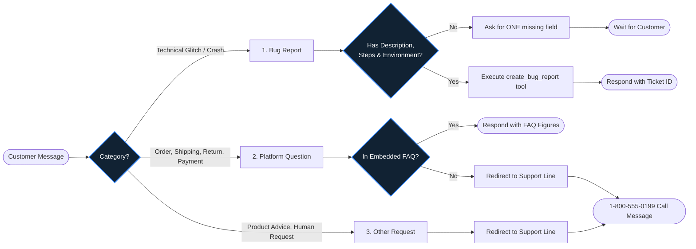
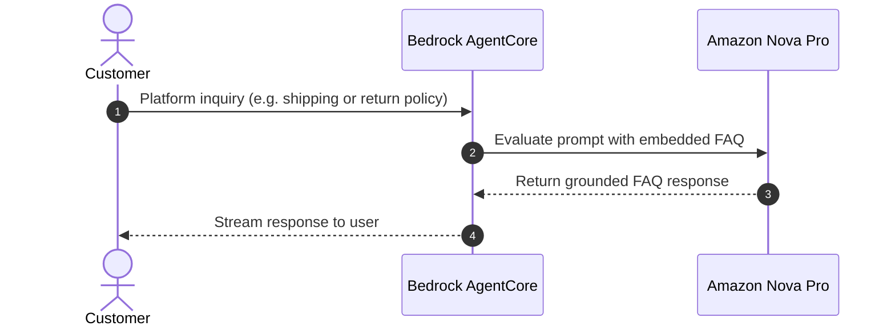
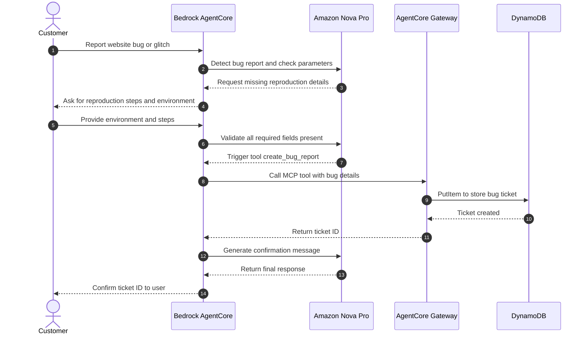
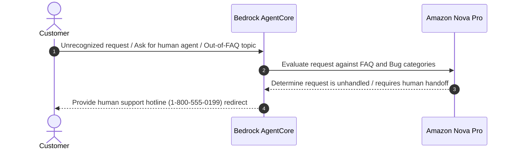
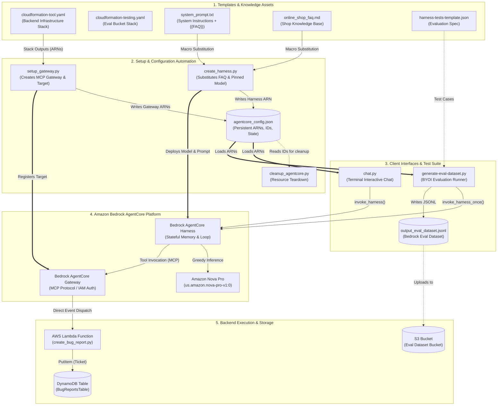

# Architecture & System Design: Customer Support Chatbot with Amazon Bedrock AgentCore

This document outlines the architecture, component design, runtime message lifecycle, and operational mechanisms of the Customer Support Chatbot starter project built on **Amazon Bedrock AgentCore**.

---

## 1. High-Level System Overview

The Customer Support Chatbot is an enterprise-grade agentic assistant engineered using AWS Bedrock's next-generation **AgentCore** ecosystem. Unlike legacy conversational interfaces or rigid intent trees, the system is designed around a **server-side managed harness**, native **Model Context Protocol (MCP)** tool gateways, and **in-context knowledge grounding**.

```
                           +-----------------------------------------------+
                           |               Customer Client                 |
                           |     (CLI Terminal `chat.py` / Web / App)     |
                           +-----------------------+-----------------------+
                                                   |
                                                   | invoke_harness (Session ID)
                                                   v
                           +-----------------------------------------------+
                           |         Bedrock AgentCore Runtime             |
                           |  (Stateful Harness + Multi-Turn Memory Loop)  |
                           +-----------------------+-----------------------+
                                                   |
              +------------------------------------+-----------------------------------+
              |                                    |                                   |
              v                                    v                                   v
+---------------------------+        +---------------------------+        +---------------------------+
|    Pillar 1: FAQ Engine   |        |   Pillar 2: Bug Intake    |        |   Pillar 3: Human Phone   |
|  In-Context Knowledge     |        |   AgentCore Gateway (MCP) |        |   Fallback Escalation     |
|  (`online_shop_faq.md`)   |        |   Lambda -> DynamoDB      |        |   Direct Agent Routing    |
+---------------------------+        +---------------------------+        +---------------------------+
```

### The Three Operational Pillars

The chatbot is instructed via its system prompt to classify incoming user intents into three distinct functional paths without requiring separate intent-classifier models or fragile external routers:

1. **E-Commerce FAQ & Platform Support:**
   - Directly answers customer inquiries regarding orders, shipping, delivery tracking, return policies, payment issues, and account settings.
   - Grounded strictly on verified platform knowledge loaded from [`online_shop_faq.md`](./online_shop_faq.md) to eliminate hallucinations.
2. **Multi-Turn Bug Ticket Intake:**
   - Interactively detects bug reports, technical anomalies, and website glitches.
   - Engages in a multi-turn elicitation dialogue to ensure all mandatory parameters (`description`, `stepsToReproduce`, `environment`) are captured.
   - Executes the `create_bug_report` tool via an AgentCore Gateway over MCP, storing the resulting ticket in Amazon DynamoDB.
3. **Fallback Routing & Escalation to Human Support:**
   - Recognizes complex disputes, account deletion/legal requests, severe order cancellations, or out-of-scope inquiries.
   - Seamlessly hands the user off to human support phone lines and email channels with standard operational hours and expectations.

### Architectural Hallmarks

- **Managed Harness Loop:** Orchestration, conversation history management, and the ReAct reasoning-acting loop run inside AWS's managed control plane rather than client-side application code.
- **MCP-Native Gateway:** Custom tools are decoupled from Bedrock and exposed as standardized Model Context Protocol endpoints authorized with `AWS_IAM`.
- **Greedy Inference Pinned to Amazon Nova Pro:** The system operates on `us.amazon.nova-pro-v1:0` with temperature `0.0` and `topK=1` for strict determinism in tool-call parameter formatting.

---

## 2. Core System Architecture & Mermaid Diagrams

### 2.1 Runtime Message Flow 

The following sequence diagram illustrates the lifecycle of customer interactions, contrasting standard FAQ/fallback responses with multi-turn tool invocation:



#### Diagram 1: FAQ Retrieval Flow
This flow handles standard platform questions grounded in the embedded FAQ.




#### Diagram 2: Multi-turn Bug Ticket Intake Flow

This flow handles technical bug reporting, parameter gathering across turns, and filing a ticket via tool invocation.





#### Diagram 3: Other Requests / Human Support Fallback Flow

This flow handles queries outside FAQ/bugs or requests not present in the FAQ by politely redirecting to human support.



### 2.2 File and Module Relationship (Flowchart)

This flowchart illustrates how repository files map to AWS infrastructure components, setup routines, configuration outputs, and runtime execution loops:



---

## 3. Deep-Dive Implementation & Code Walkthrough

### 3.1 Bedrock AgentCore Managed Harness Initialization (`create_harness.py`)

The file [`create_harness.py`](./create_harness.py) provisions and synchronizes the server-side managed harness that orchestrates conversation state and tool dispatching.

#### 1. Explicit Model Pinning & Greedy Decoding
AgentCore harnesses require explicit model specification to avoid non-deterministic behavior or dependencies on unconfigured marketplace models:

```python
def model_config(model_id):
    return {
        "bedrockModelConfig": {
            "modelId": model_id,
            "temperature": 0.0,
            "additionalParams": {
                "additionalModelRequestFields": {
                    "inferenceConfig": {"topK": 1}
                }
            },
        }
    }
```

- **Model ID:** Explicitly locked to `us.amazon.nova-pro-v1:0`.
- **Greedy Decoding:** Temperature is set to `0.0` and `topK` to `1`. In agentic architectures, greedy decoding minimizes hallucinations and ensures that tool schemas and JSON parameters conform strictly to the required format.

#### 2. Dynamic Knowledge Base Substitution
The harness combines instructions and knowledge at harness compilation time:

```python
def load_prompt(prompt_path, faq_path):
    prompt = Path(prompt_path).read_text(encoding="utf-8")
    if FAQ_PLACEHOLDER in prompt:
        faq = Path(faq_path).read_text(encoding="utf-8")
        prompt = prompt.replace(FAQ_PLACEHOLDER, faq)
    return prompt
```

The placeholder `{{FAQ}}` in [`system_prompt.txt`](./system_prompt.txt) is substituted with the entire contents of [`online_shop_faq.md`](./online_shop_faq.md), creating a unified context window.

#### 3. Idempotent Create / Update Lifecycle Management
To enable rapid developer iteration, `create_harness.py` handles existing harnesses gracefully:

```python
existing = find_harness(acc, args.name)
if existing:
    harness_id = existing.get("harnessId")
    if existing.get("status") in ("CREATING", "UPDATING"):
        wait_ready(acc, harness_id)
    acc.update_harness(
        harnessId=harness_id,
        executionRoleArn=config["harness_execution_role_arn"],
        model=model_config(args.model),
        systemPrompt=[{"text": prompt}],
    )
```

- When iterating on prompt design, rerunning `python create_harness.py` calls `update_harness` rather than failing with duplicate resource errors.
- It polls `wait_ready(acc, harness_id, timeout=360)` until status resolves to `READY`, capturing transient states (`CREATING`, `UPDATING`) and catching fatal exceptions (`FAILED`, `DELETING`).
- It accommodates AWS IAM role propagation delays by implementing retry loops with exponential backoff on initial creation.

---

### 3.2 Custom Tool Registration & Execution (`setup_gateway.py` & `create_bug_report.py`)

Tools are integrated via an **AgentCore Gateway** conforming to Anthropic's **Model Context Protocol (MCP)** specification.

#### 1. Tool Schema Registration (`setup_gateway.py`)
In [`setup_gateway.py`](./setup_gateway.py), the tool contract is exposed through standard JSON Schema:

```python
TOOL_SCHEMA = {
    "name": "create_bug_report",
    "description": (
        "File a bug ticket in the engineering team's tracker. "
        "Call this only after the customer has provided a bug description, "
        "the steps to reproduce it, and their environment. "
        "Returns the new ticket's ID."
    ),
    "inputSchema": {
        "type": "object",
        "properties": {
            "description": {"type": "string", "description": "What is broken, in the customer's words."},
            "stepsToReproduce": {"type": "string", "description": "Steps to follow to reproduce the issue."},
            "environment": {"type": "string", "description": "Customer's environment: browser, OS, device."},
        },
        "required": ["description", "stepsToReproduce", "environment"],
    },
}
```

#### 2. Critical Naming Syntax Constraint
The gateway target name is registered as:
```python
acc.create_gateway_target(
    gatewayIdentifier=gateway_id,
    name="bugreports",
    targetConfiguration={
        "mcp": {
            "lambda": {
                "lambdaArn": lambda_arn,
                "toolSchema": {"inlinePayload": [TOOL_SCHEMA]},
            }
        }
    },
    credentialProviderConfigurations=[
        {"credentialProviderType": "GATEWAY_IAM_ROLE"}
    ],
)
```

> [!WARNING]
> **Gateway Target Naming Rule:** Target names must contain **letters, digits, and underscores only (`[a-zA-Z0-9_]`)**. Hyphens (dashes) cause the Nova model's tokenizer and parser to fail during tool selection with the error: `"Model produced invalid sequence as part of ToolUse"`.

The resulting tool name presented to Nova Pro is:
$$\text{Tool Name} = \text{targetName} \mathbin{\Vert} \texttt{"\_\_\_"} \mathbin{\Vert} \text{toolName} \longrightarrow \texttt{"bugreports\_\_\_create\_bug\_report"}$$

#### 3. Lambda Invocation & Strict Validation (`create_bug_report.py`)
The tool execution logic resides in [`create_bug_report.py`](./create_bug_report.py):

```python
table = boto3.resource("dynamodb").Table(os.environ["TABLE_NAME"])

def lambda_handler(event, context):
    # Tool arguments arrive directly as root JSON keys in the event
    description = str(event.get("description") or "").strip()
    steps = str(event.get("stepsToReproduce") or "").strip()
    environment = str(event.get("environment") or "").strip()

    missing = [name for name, value in [("description", description),
                                        ("stepsToReproduce", steps),
                                        ("environment", environment)] if not value]
    if missing:
        return {
            "error": "missing required field(s): " + ", ".join(missing)
                     + ". Ask the customer for them before filing the ticket."
        }

    ticket_id = str(uuid.uuid4())
    item = {
        "ticketId": ticket_id,
        "description": description,
        "stepsToReproduce": steps,
        "environment": environment,
        "status": "OPEN",
        "createdAt": datetime.now(timezone.utc).isoformat(),
    }
    table.put_item(Item=item)
    return {"ticketId": ticket_id, "status": "OPEN"}
```

Key aspects:
- **Direct Event Unpacking:** Unlike Bedrock Agents Classic, which wrapped payload parameters inside complex nested structures (`messageVersion`, `actionGroup`, `parameters`), the AgentCore Gateway passes arguments directly as top-level keys in the `event` dictionary.
- **Client Context Metadata:** The full namespaced tool identifier is passed in `context.client_context.custom["bedrockAgentCoreToolName"]`.
- **Self-Correcting Prompt Re-injection:** If an LLM submits empty strings for required parameters, the Lambda returns an informative error dictionary. The harness feeds this back to the model, instructing it to prompt the customer for the missing parameters.

---

### 3.3 FAQ Knowledge Retrieval Mechanism

Knowledge retrieval in this architecture uses **in-context dynamic grounding**:

```
+------------------------------------+
|         system_prompt.txt          |
| +--------------------------------+ |
| | Core Rules & Persona           | |
| +--------------------------------+ |
| | {{FAQ}} Placeholder            | | ======> Replaced by create_harness.py
| |  -> Loaded from                | |         with markdown sections
| |     online_shop_faq.md         | |
| +--------------------------------+ |
| | Fallback & Tool Instructions   | |
| +--------------------------------+ |
+------------------------------------+
                  |
                  v
+------------------------------------+
|  AgentCore Managed Harness System  |
|  (Embedded Knowledge Context)      |
+------------------------------------+
```

1. **Why In-Context over External RAG?**
   - For focused enterprise catalogs and policy handbooks (such as [`online_shop_faq.md`](./online_shop_faq.md) with 32 structured Q&A pairs covering Orders, Shipping, Returns, Payments, and Privacy), embedding the full FAQ in the system prompt provides lower latency and higher recall than vector chunking and embeddings.
   - It eliminates embedding drift, chunk boundary truncation, and OpenSearch / Bedrock Knowledge Base infrastructure overhead.
2. **Grounding Directives:**
   - The model is instructed to answer platform questions exclusively from the injected text.
   - If an inquiry falls outside the scope of the FAQ (for instance, specific order lookups or inventory status not covered in general rules), the model avoids guessing and activates the fallback routing path.

---

### 3.4 Conversational State Management & Fallback Routing

#### 1. Multi-Turn Session Persistence (`chat.py`)
In [`chat.py`](./chat.py), conversation continuity is established via `runtimeSessionId`:

```python
# Session ids must be at least 33 characters (e.g., UUID + suffix)
session_id = f"{uuid.uuid4()}-support-chat"

response = rt.invoke_harness(
    harnessArn=config["harness_arn"],
    runtimeSessionId=session_id,
    model={"bedrockModelConfig": {"modelId": config.get("model_id", "us.amazon.nova-pro-v1:0")}},
    tools=[{
        "type": "agentcore_gateway",
        "name": "support_gateway",
        "config": {"agentCoreGateway": {"gatewayArn": config["gateway_arn"]}},
    }],
    messages=[{"role": "user", "content": [{"text": user_text}]}],
)
```

Because the harness is stateful on AWS Bedrock's side, developers do not need to manage local Redis instances or database backends to persist past dialogue turns. When a user states *"The cart button crashed"*, the harness maintains context across subsequent turns as it gathers steps to reproduce and environment information.

#### 2. Human Fallback Routing Logic
The decision boundary for escalating to a human support agent is governed by instructions in [`system_prompt.txt`](./system_prompt.txt):
- **Escalation Triggers:**
  - Requests requiring account mutations or direct database edits (such as account deletion requests per FAQ item 28, or modifying an already-packed order per FAQ item 3).
  - Out-of-scope inquiries not answered by the FAQ.
  - Frustrated sentiment, repeated misunderstandings, or complex payment disputes.
- **Escalation Response Pattern:**
  - The model outputs the direct contact channels specified in the FAQ:
    - Official contact form / order email replies.
    - Support business hours (Monday–Friday, 1–2 business days turnaround).
    - Customer support hotline instructions.

---

### 3.5 Automated Evaluation Pipeline (`generate-eval-dataset.py`)

The project includes an automated evaluation harness in [`generate-eval-dataset.py`](./generate-eval-dataset.py) compatible with **Amazon Bedrock Evaluations (LLM-as-a-judge / Bring-Your-Own-Inference)**:

1. Loads test assertions from [`harness-tests-template.json`](./harness-tests-template.json).
2. Spawns isolated execution sessions per test case using dynamic runtime IDs (`f"{uuid.uuid4()}-evalcase"`) to prevent inter-test contamination.
3. Formats evaluation results into the standard Bedrock Evaluations JSONL schema:
   ```json
   {
     "prompt": "How do I return an item?",
     "referenceResponse": "You can return most items within 30 days...",
     "modelResponses": [
       {
         "response": "...",
         "modelIdentifier": "my-support-chatbot"
       }
     ]
   }
   ```
4. Stores datasets in the S3 evaluation bucket provisioned by [`cloudformation-testing.yaml`](./cloudformation-testing.yaml) for automated quality scoring.

---

## 4. Project Directory Layout

Below is the directory structure of the repository, including annotations for each component:

```
.
├── .env                                # Local environment variables (AWS profiles, keys)
├── .gitignore                          # Excludes caches, virtual environments, and generated configs
├── Architecture.md                     # Comprehensive architecture and system specification
├── README.md                           # Coursework licensing, authors, and summary
├── requirements.txt                    # Python dependencies (boto3, botocore, etc.)
│
├── system_prompt.txt                   # Master system prompt defining behavior & {{FAQ}} placeholder
├── online_shop_faq.md                  # Domain knowledge base (Orders, Shipping, Returns, Accounts)
│
├── cloudformation-tool.yaml            # CloudFormation: DynamoDB table, Lambda function, and IAM roles
├── cloudformation-testing.yaml         # CloudFormation: S3 bucket and IAM role for Bedrock Evaluations
│
├── setup_gateway.py                    # Gateway setup: Creates AgentCore Gateway & registers MCP target
├── create_harness.py                   # Harness setup: Compiles prompt, configures Nova Pro, and deploys harness
├── create_bug_report.py                # Standalone reference code for create_bug_report Lambda function
├── chat.py                             # Interactive terminal chat client with event stream parsing
├── cleanup_agentcore.py                # Teardown script: Safely deletes harness, gateway targets, and gateway
│
├── generate-eval-dataset.py            # Evaluation runner: Executes test cases and produces eval JSONL
└── harness-tests-template.json         # JSON schema template for evaluation test suites
```

---

## 5. Key Configuration & Environment Variables

### 5.1 Dynamic State Configuration (`agentcore_config.json`)

When `setup_gateway.py` and `create_harness.py` execute, they maintain a local configuration artifact (`agentcore_config.json`) that acts as the single source of truth for runtime scripts:

| Key | Example Value | Description |
|---|---|---|
| `region` | `us-east-1` | AWS Region hosting the Bedrock AgentCore services. |
| `stack_name` | `bug-report-tool-stack` | CloudFormation stack name for backend tool resources. |
| `table_name` | `bug-report-tool-stack-bug-reports` | Amazon DynamoDB table storing bug tickets. |
| `lambda_arn` | `arn:aws:lambda:us-east-1:...:function:...` | ARN of the bug report Lambda function. |
| `gateway_name` | `bug-report-tool-stack-gateway` | Name of the AgentCore MCP Gateway. |
| `gateway_id` | `gw-abc123xyz` | Unique identifier of the AgentCore Gateway. |
| `gateway_arn` | `arn:aws:bedrock-agentcore:us-east-1:...:gateway/...` | Gateway ARN passed to `invoke_harness` tools array. |
| `gateway_target_id` | `tgt-987654` | Gateway target identifier registered for Lambda. |
| `gateway_target_name`| `bugreports` | Gateway target namespace prefix (letters/numbers/`_` only). |
| `harness_execution_role_arn` | `arn:aws:iam:...:role/HarnessExecutionRole` | Role assumed by Bedrock to run the harness. |
| `harness_name` | `support_chatbot` | Friendly identifier of the AgentCore managed harness. |
| `harness_id` | `harn-55443322` | Unique identifier of the managed harness. |
| `harness_arn` | `arn:aws:bedrock-agentcore:us-east-1:...:harness/...` | ARN invoked by `chat.py` and `generate-eval-dataset.py`. |
| `model_id` | `us.amazon.nova-pro-v1:0` | Foundation model ID pinned on harness and invoke requests. |

### 5.2 Environment Variables & IAM Roles

- **Lambda Environment Variables:**
  - `TABLE_NAME`: Injected by CloudFormation into `CreateBugReportFunction` to point to the DynamoDB table.
- **Session ID Constraint:**
  - `runtimeSessionId`: Must be $\ge 33$ characters long. Standard pattern: `f"{uuid.uuid4()}-<label>"`.
- **IAM Roles Separation:**
  1. **`LambdaExecutionRole`:** Allows Lambda to write CloudWatch logs and execute `dynamodb:PutItem` on the bug reports table.
  2. **`GatewayRole`:** Assumed by `bedrock-agentcore.amazonaws.com` to invoke the tool Lambda (`lambda:InvokeFunction`).
  3. **`HarnessExecutionRole`:** Assumed by the managed harness to invoke Bedrock foundation models (`bedrock:InvokeModel*`), post CloudWatch telemetry, and invoke the gateway (`bedrock-agentcore:InvokeGateway`).
  4. **`BedrockEvalRole`:** Grants Amazon Bedrock read/write permissions to the S3 evaluation dataset bucket and model invocation access.

---

## 6. Developer Extensibility Guide

This section outlines how developers can extend the starter system with new tools or specialized routing behaviors.

### 6.1 Adding a New Custom Tool (e.g., `lookup_order_status`)

To introduce a new tool (such as order lookup by ID), follow these steps:

#### Step 1: Add or Extend the Lambda Handler
Add a handler function or extend [`create_bug_report.py`](./create_bug_report.py) to process the new tool:

```python
def handle_lookup_order(event):
    order_id = event.get("orderId")
    # Query DynamoDB or commerce API
    return {"orderId": order_id, "status": "SHIPPED", "trackingUrl": "https://track.example.com"}
```

#### Step 2: Define the JSON Schema Contract
In [`setup_gateway.py`](./setup_gateway.py), define the schema following the Model Context Protocol:

```python
ORDER_TOOL_SCHEMA = {
    "name": "lookup_order_status",
    "description": "Look up shipping and processing status for an existing customer order.",
    "inputSchema": {
        "type": "object",
        "properties": {
            "orderId": {"type": "string", "description": "The 8-character order identifier."}
        },
        "required": ["orderId"]
    }
}
```

#### Step 3: Register the Target in AgentCore Gateway
Add the new schema to `inlinePayload` in `create_gateway_target` or attach a second target under a distinct alphanumeric target name (e.g., `orders___lookup_order_status`).

#### Step 4: Update System Prompt Instructions
Update [`system_prompt.txt`](./system_prompt.txt) to teach the model when to call the tool:
```text
When the customer asks about order status and provides an order number,
call the orders___lookup_order_status tool before answering.
```
Run `python create_harness.py` to compile the updated prompt into the harness.

---

### 6.2 Custom Routing & Multi-Agent Triage Enhancements

Developers can extend the routing and triage behavior through several patterns:

1. **Sentiment-Driven Automatic Escalation:**
   - Add prompt directives instructing the model to monitor user frustration signals.
   - If sentiment is detected as hostile or unsatisfied across two consecutive turns, the model bypasses standard FAQ answers and provides direct escalation numbers and a transfer code.
2. **Integration with External Ticketing / CRM Platforms:**
   - Modify the Lambda handler to forward bug reports or escalation requests to Jira Service Desk, Zendesk, or Salesforce Service Cloud via REST APIs.
3. **AgentCore Memory Integration:**
   - Leverage Bedrock AgentCore's native `bedrock-agentcore:RetrieveMemoryRecords` and `CreateEvent` capabilities (already pre-authorized in [`cloudformation-tool.yaml`](./cloudformation-tool.yaml)) to persist user preferences across sessions.
